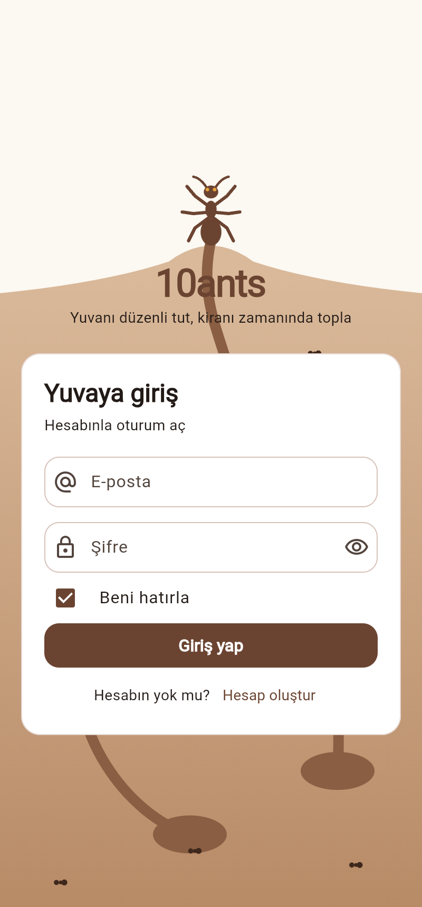
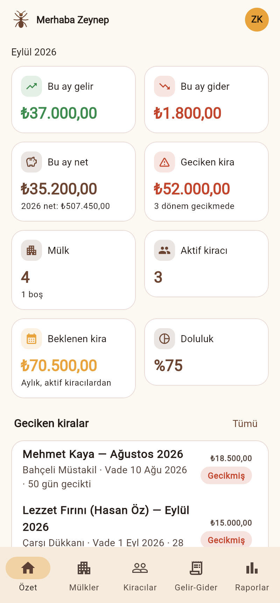
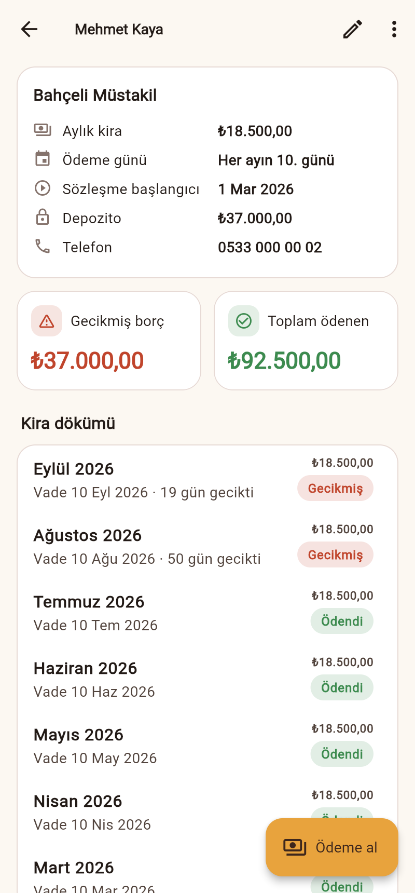
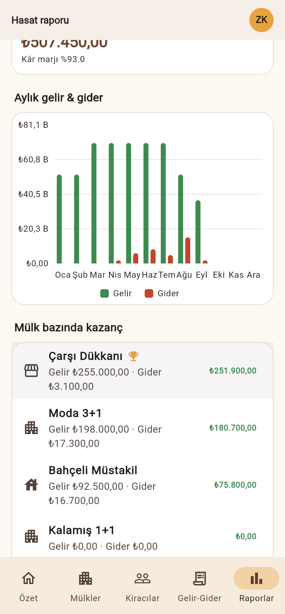

# 🐜 10ants

**Karınca temalı kiracı ve mülk takip uygulaması** — Flutter ile yazılmıştır; Android, iOS ve web'de çalışır.

Ev ve daire sahiplerinin mülklerini, kiracılarını, gelir-giderlerini ve geciken kiralarını tek yerden takip etmesini sağlar. Karıncaların yuvalarına erzak taşıdığı gibi, kiraların da düzenli toplanmasına yardım eder.

| Giriş | Özet | Kiracı & kira dökümü | Hasat raporu |
|---|---|---|---|
|  |  |  |  |

## Özellikler

**Hesap**
- Hesap oluşturma, giriş, "beni hatırla", çıkış
- Şifre değiştirme (mevcut şifre doğrulanarak), profil güncelleme
- Hesabı ve tüm verileri silme
- Şifreler PBKDF2-HMAC-SHA256 (tuzlu, 20.000 iterasyon) ile hashlenir; düz metin saklanmaz
- Her kullanıcı yalnızca kendi verisini görür

**Mülkler** — daire, müstakil ev, villa, dükkan, ofis, arsa; adres ve notlar. Her mülk kartında yıllık gelir/gider/net, dolu/boş durumu ve kiracı borcu.

**Kiracılar** — kira tutarı, ödeme günü, sözleşme başlangıç/bitiş, depozito, iletişim bilgileri. Kiracı çıkışı yapılabilir; geçmiş kayıtlar korunur.

**Kira takibi**
- Sözleşme başlangıcından itibaren her ay için otomatik kira dönemi
- Durumlar: *Ödendi*, *Kısmi ödendi*, *Bekleniyor*, *Gecikmiş* (kaç gün geciktiği ile)
- Kısmi ödemeler; peşin ödeme (gelecek ay)
- Ödeme günü ayın gün sayısını aşarsa (ör. 31) ayın son günü kullanılır
- **Geciken kiralar** ekranı: kiracı bazında gruplanmış toplam alacak

**Gelir & gider** — kira, depozito, aidat, tamir-bakım, emlak vergisi, DASK-sigorta, fatura, kredi taksiti vb. Ay/mülk/tür filtresi. Mülkten bağımsız "genel" giderler.

**Raporlar** — yıllık gelir, gider, net kazanç ve kâr marjı; aylık gelir-gider grafiği; **mülk bazında kazanç** sıralaması (en kârlı mülk 🏆); kategori dağılımı.

**Özet paneli** — bu ayın gelir/gider/neti, geciken kira toplamı, doluluk oranı, bu ay beklenen ödemeler, son 6 ay grafiği.

İlk girişte **"Örnek verilerle dene"** ile uygulamayı hazır verilerle keşfedebilirsiniz.

## Çalıştırma

Flutter 3.35+ (Dart 3.9+) gerekir.

```bash
flutter pub get
flutter run                 # bağlı cihaz / emülatör
flutter run -d chrome       # web
flutter test                # testler
```

Derleme:

```bash
flutter build apk --release
flutter build ios --release
flutter build web --release
```

## GitHub Actions ile APK

Her push ve pull request'te [`android-apk.yml`](.github/workflows/android-apk.yml) iş akışı çalışır: analiz ve testler geçerse **debug** ve **release** APK derlenir.

1. GitHub'da depoda **Actions** sekmesine gidin → **Android APK** → en son çalıştırmayı açın.
2. Sayfanın altındaki **Artifacts** bölümünden `10ants-debug-apk` veya `10ants-release-apk` dosyasını indirin (zip içinde APK bulunur; 30 gün saklanır).
3. Elle çalıştırmak için: Actions → Android APK → **Run workflow**.
4. `v1.0.0` gibi bir etiket gönderirseniz APK'lar otomatik olarak bir **GitHub Release**'e eklenir:
   ```bash
   git tag v1.0.0 && git push origin v1.0.0
   ```

> Release APK şimdilik debug anahtarıyla imzalanır; telefona yüklenebilir ama Google Play'e yüklemek için kendi imza anahtarınız gerekir.

## Mimari

```
lib/
├── main.dart                 # Uygulama girişi, tema, Türkçe yerelleştirme, AuthGate
├── theme.dart                # Karınca yuvası renk paleti (toprak, amber, yaprak)
├── models/models.dart        # AppUser, Property, Tenant, Txn
├── data/                     # sembast veritabanı (mobil: dosya, web: IndexedDB)
├── services/
│   ├── auth_service.dart     # Kayıt, giriş, şifre değiştirme, oturum
│   ├── password_hasher.dart  # PBKDF2 şifre hashleme
│   ├── data_store.dart       # Kullanıcıya ait CRUD + sahiplik kontrolleri
│   ├── rent_calculator.dart  # Kira dönemleri, gecikme hesabı
│   └── reports.dart          # Toplamlar, aylık ve mülk bazında raporlar
├── screens/                  # Giriş/kayıt, özet, mülkler, kiracılar, gelir-gider, raporlar, ayarlar
└── widgets/                  # Karınca logosu, yuva arka planı, grafikler, ortak bileşenler
```

- **Veri**: [sembast](https://pub.dev/packages/sembast) ile cihazda saklanır; sunucu gerekmez, çevrimdışı çalışır.
- **Durum yönetimi**: [provider](https://pub.dev/packages/provider) — `AuthService` ve `DataStore` (`ChangeNotifier`).
- **Grafikler**: [fl_chart](https://pub.dev/packages/fl_chart).

> Not: Veriler cihazda tutulduğundan hesaplar cihaza özeldir. Birden fazla cihaz arasında senkronizasyon (ör. Firebase) ileride `AuthService` / `DataStore` katmanı değiştirilerek eklenebilir.
